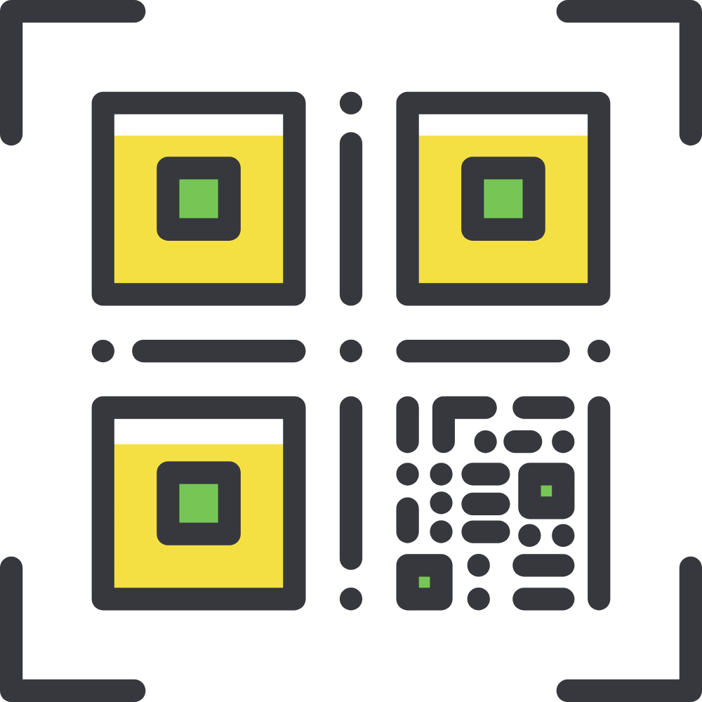
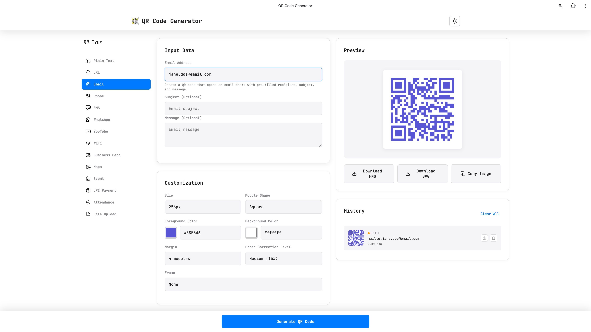
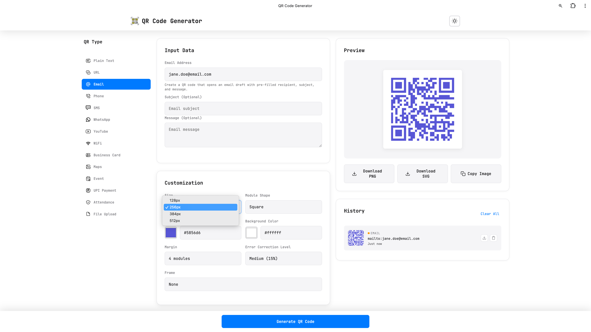
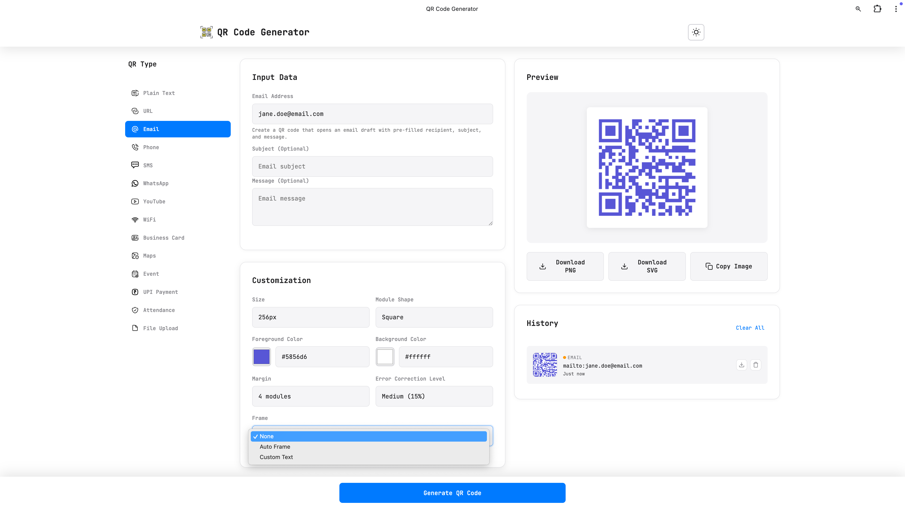
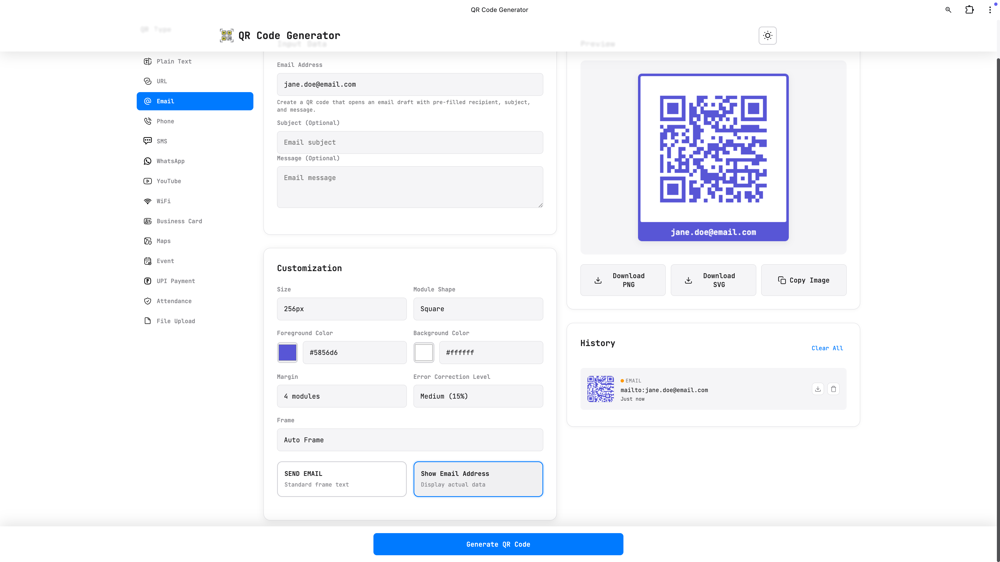
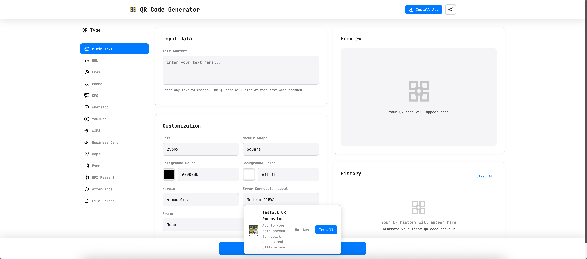
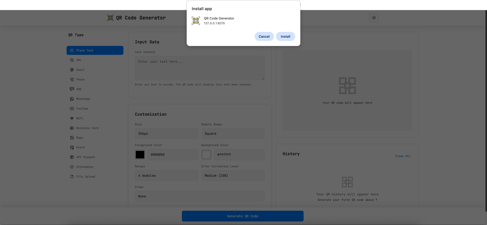
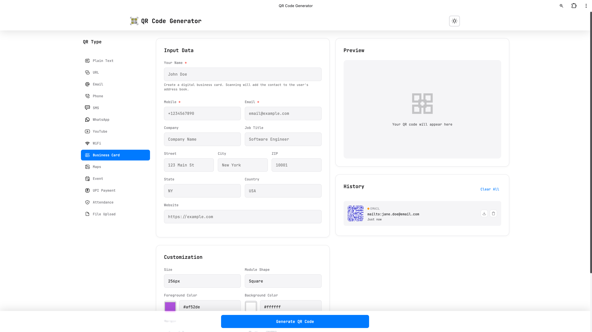
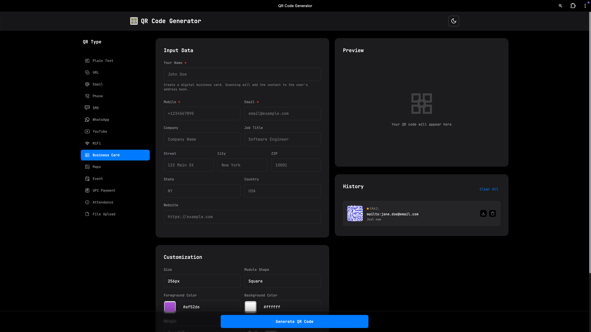

<div align="center">
  
  
  # QR Code Generator

  **Version 0.1.3**

  A modern, responsive web application for generating QR codes with extensive customization options. Features an intuitive layout with icon-based navigation, built with vanilla JavaScript and designed to work seamlessly across all devices.

</div>

## Features

### Progressive Web App (PWA)
- **Installable** - Add to home screen on mobile and desktop
- **Offline Support** - Works without internet connection
- **Auto Updates** - Automatically updates when new version available
- **Native-like Experience** - Runs in standalone mode like a native app

### QR Code Types
- **Plain Text** - Generate QR codes for any text content
- **URLs** - Create QR codes for websites with automatic protocol handling
- **Email** - Generate mailto links with subject and body
- **Phone** - Create tel: links for quick dialing
- **SMS** - Generate SMS links with pre-filled messages
- **WhatsApp** - Create WhatsApp conversation links with optional pre-filled messages
- **YouTube** - Generate QR codes for YouTube channels (@username), videos, shorts, and playlists with smart URL detection
- **WiFi** - Share WiFi credentials easily
- **Business Card (vCard)** - Create contact cards with name, phone, email, company, address, and more
- **Maps** - Google Maps & Apple Maps - Share locations with direct map links
- **Event** - Create calendar events with name, location, date/time, description, and organizer
- **UPI Payment** - Generate UPI payment QR codes for instant payments (India) with optional amount and transaction notes
- **Attendance** - Create attendance tracking QR codes with location check-in/out, geolocation capture, and WhatsApp/Email reporting
- **File Upload** - Share files via QR codes using gofile.io API with upload progress tracking and download link generation
- **AR Experience** - Create augmented reality QR codes using AR.js for marker-based AR with 3D models (.glb/.gltf)

### Customization Options
- **Size Control** - Adjustable from 128px to 512px
- **Module Shapes** - Square, Rounded, Circle, Diamond, Dots
- **Color Customization** - Custom foreground and background colors side-by-side
- **Type-Specific Default Colors** - Each QR type has unique default colors that automatically apply
- **Margin Control** - Adjustable QR code margins
- **Error Correction Levels** - Low (7%), Medium (15%), Quartile (25%), High (30%)
- **Frame Options** - Add professional frames with automatic or custom text labels

### Export Options
- Download as PNG
- Download as SVG
- Copy to clipboard
- Print functionality

### Frame Feature
- **Auto Frame** - Two display options for select QR types:
  - **Standard Text**: Generic labels (e.g., "GO TO WEBSITE", "SEND EMAIL", "ADD TO CALENDAR", "WATCH ON YOUTUBE", "DOWNLOAD FILE", "VIEW IN AR")
  - **Contextual Data**: Shows actual content (URL, email address, phone number, WiFi network name, contact name, event name, location name, YouTube channel/video info, UPI payee name, filename, AR experience name)
  - Single option types (Plain Text, SMS, WhatsApp) show standard text only
- **Custom Frame** - Add your own custom text (up to 30 characters)
- **Professional Design** - Frame uses QR foreground color with contrasting text

### UI/UX Features
- **3-Column Desktop Layout** - Organized interface with sidebar navigation, input/customization center, and preview/history on the right
- **Icon-Based Navigation** - Visual QR type selection with intuitive icons in the sidebar
- **Dark/Light Theme** - Toggle between themes
- **History Management** - Last 10 generated QR codes saved locally with frame settings
- **Responsive Design** - Adapts seamlessly:
  - Desktop (>1200px): 3-column layout with sidebar navigation
  - Tablet (768-1200px): 2-column layout with dropdown selector
  - Mobile (<768px): Single column with dropdown selector
- **Keyboard Shortcuts** - Quick actions with Alt + key combinations

## Technologies Used

- **HTML5** - Semantic markup
- **CSS3** - Modern styling with CSS Grid and Flexbox
- **JavaScript (ES6+)** - Modular architecture with ES6 modules
- **qrcode.js** - QR code generation library
- **JetBrains Mono** - Monospace font for consistent appearance

## Quick Start

1. Clone the repository:
```bash
git clone https://github.com/yourusername/QRCode-Generator.git
cd QRCode-Generator
```

2. Start a local web server (required for ES6 modules):

**Option 1: Python 3**
```bash
python3 -m http.server 8000
```

**Option 2: Node.js (npx)**
```bash
npx serve
```

**Option 3: VS Code**
- Install the "Live Server" extension
- Right-click on `index.html` and select "Open with Live Server"

3. Open your browser and navigate to:
- `http://localhost:8000` (Python)
- `http://localhost:3000` (npx serve)
- `http://127.0.0.1:5500` (VS Code Live Server)

> **Note:** A web server is required because the app uses ES6 modules, which are blocked by CORS policy when opening files directly due to browser security restrictions.

## How to Generate QR Codes

### Step-by-Step Guide

#### 1. Select QR Type
Choose from various QR code types using the sidebar navigation


#### 2. Customize Size
Adjust the QR code size from 128px to 512px


#### 3. Customize Module Shape
Choose between Square, Rounded, Circle, Diamond, or Dots shapes


#### 4. Customize Colors
Set custom foreground and background colors


#### 5. Adjust Margin
Control the white space around your QR code


#### 6. Select Frame
Add professional frames to your QR codes


#### 7. Auto Frame - Standard Text Option
Display generic action labels on frames


#### 8. Auto Frame - Contextual Data Option
Show actual content (URL, email, phone) on frames


#### 9. Custom Text Frame
Add your own custom text to frames (up to 30 characters)


#### 10. UPI Payment QR Code
Generate UPI payment QR codes for instant payments (India)


#### 11. Attendance QR Code
Create attendance tracking QR codes with location check-in/out


#### 12. Upload File
Share files via QR codes using gofile.io API


#### 13. File Download QR Code
Generated QR code with download link for shared files


#### 14. AR Experience QR Code
Create augmented reality experiences with AR.js - scan to view 3D models on markers


### Additional Features

#### Install as Progressive Web App
Install the app for offline use and native-like experience



#### Theme Options
Switch between light and dark themes



## Project Structure

```
├── index.html              # Main HTML file
├── ar.html                # AR.js viewer page for augmented reality
├── manifest.json          # PWA manifest configuration
├── service-worker.js      # Service worker for offline support
├── offline.html           # Offline fallback page
├── css/
│   ├── styles.css         # Primary styles
│   └── responsive.css     # Responsive design rules
├── js/
│   ├── app.js             # Main application controller
│   ├── qrGenerator.js     # QR generation logic
│   ├── uiController.js    # UI interactions
│   ├── downloadManager.js # Export functionality
│   ├── historyManager.js  # History management
│   ├── themeManager.js    # Theme switching
│   ├── installPrompt.js   # PWA install prompt handler
│   └── fileUploadManager.js # File upload to gofile.io
└── assets/
    ├── icons/             # PWA app icons (72x72 to 512x512)
    ├── ui-icons/          # UI interface icons (SVGs)
    └── logo.png           # App logo

```

## Keyboard Shortcuts

- `Ctrl/Cmd + Enter` - Generate QR Code
- `Alt + G` - Generate QR Code
- `Alt + D` - Download as PNG
- `Alt + C` - Copy to clipboard
- `Alt + T` - Toggle theme
- `Alt + 1-9, 0, -, U, A, F, R` - Quick switch QR type (1=Text, 2=URL, 3=Email, 4=Phone, 5=SMS, 6=WhatsApp, 7=YouTube, 8=WiFi, 9=vCard, 0=Maps, -=Event, U=UPI, A=Attendance, F=File, R=AR)
- `Ctrl/Cmd + Shift + L` - Toggle theme

## Browser Support

- Chrome 90+
- Firefox 88+
- Safari 14+
- Edge 90+

## Copyright

Copyright © 2025 Varun Nidhi

## License

This project is licensed under the Mozilla Public License 2.0 (MPL 2.0).

The MPL 2.0 is a copyleft license that is easy to comply with. You can use, modify, and distribute this software, even for commercial purposes. However, if you modify files covered by MPL 2.0, you must make the source code of those modifications available under the same license. You can combine MPL-licensed code with code under other licenses (including proprietary licenses), as long as you keep the MPL-licensed files separate.

For the full license text, see [Mozilla Public License 2.0](https://www.mozilla.org/en-US/MPL/2.0/).
